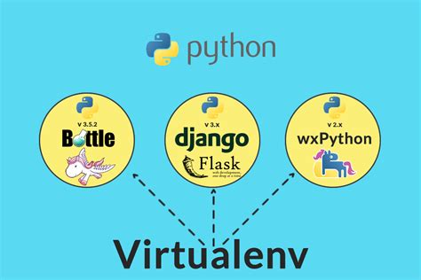

class: center, middle


# Sesión 1: Conceptos básicos

---

## Agenda

- Instalación de Python y entornos virtuales
- Tipos de datos y estructuras de control
- Funciones y clases
- Decoradores

---

class: center, middle

## Instalación y entornos virtuales

---

## Instalación

Si estás utilizando alguna distribución basada en GNU/Linux ya tienes Python instalado
en tu computadora.

Si tienes Windows tendrás que ingresar al siguiente enlace para descargar el instalador

https://www.python.org/downloads/

Una vez terminado el proceso de instalación verificaremos con la instrucción `python -V`

---

class: center, middle

## Entornos virtuales



---

Para instalar virtualenv haremos uso del comando pip. Este comando nos ayuda a buscar dentro del
repositorio de paquetes de Python.

> `pip search virtualenv`

> `pip install virtualenv`

---
### Creación de un entorno virtual

Para crear un entorno virtual usaremos el comando recién instalado de la siguiente manera:

> `virtualenv mi_venv`

> `virtualenv -p /usr/bin/python3 mi_venv`

### Activar el entorno virtual

`source mi_venv/bin/activate`

---

class: center, middle

## Tipos de datos y estructuras de control

---

En Python existe distintos tipos de datos primitivos que podemos usar para definir
variables.

```python
entero = 3
real = 4.5
booleano = True
cadena = "Hola a todos"

mi_lista = [1, 2, "hola", "azul", 6]
mi_tupla = (1, "Adios", 4, 6)
mi_diccionario = {
    "nombre": "Maricela",
    "apellido": "Sanchez"
}

```

---

class: center, middle

## Estructuras de control

---

### If... else

```python
if esta_lloviendo:
    print("Tomar paraguas")
```

### for

```python
for i in range(1, 11):
    print(i)
```

### while

```python
a = 0
while a < 10:
   a = a + 1
   print a
```

---

class: center, middle

## Funciones y clases

---

## Funciones

```python
def sumar(primer_numero, segundo_numero):
    return primer_numero + segundo_numero
```

---

## Clases

```python
class Bicicleta:
    def __init__(self, rodada, velocidad):
        # Atributos
        self.rodada = rodada
        self.velocidad = velocidad

    #Comportamiento

    def cambiar_velocidad(self, nueva_velocidad):
        self.velocidad = nueva_velocidad

    def frenar(self):
        self.velocidad = 0
```

---

## Decoradores

```python
def my_decorator(func):
    def wrapper():
        print("Something is happening before the function is called.")
        func()
        print("Something is happening after the function is called.")
    return wrapper

def say_whee():
    print("Whee!")

say_whee = my_decorator(say_whee)
```

### Syntactic sugar

```python
def my_decorator(func):
    def wrapper():
        print("Something is happening before the function is called.")
        func()
        print("Something is happening after the function is called.")
    return wrapper

@my_decorator
def say_whee():
    print("Whee!")
```

---

```python
def to_uppercase(func):
    def wrapper(name):
        return func(name).upper()
    return wrapper

@to_uppercase
def get_name(name):
    return f'Hola {name}'
```


